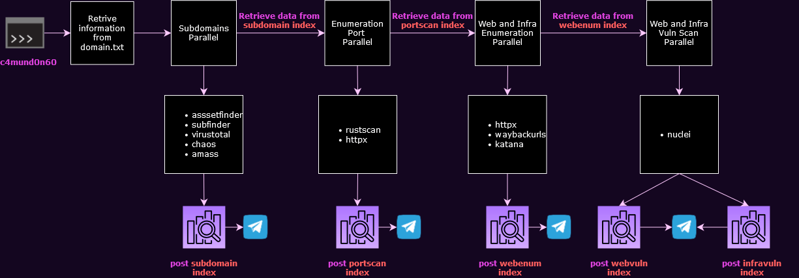

# c4mund0n60 tool
<p align="center">
  
</p>

- c4mund0n60 is a tool that use output of known tools for generate smart information about a domain(target);
- c4mund0n60 is integrate with Telegram and notify new subdomains founded , open ports and vulnerabilitys automatic.

# Flowchart 

# Installation Guide
## **THE Step 2.3 IS MANDATORY**
### Step 1 - Download and Build docker image
```
git clone https://github.com/CircuitSoul/c4mund0n60
cd c4mund0n60
docker image build -t c4mund0n60-tools:1.0 .
```
### Step 2 - Environment setup and install dependencies
##### Step 2.1 - ElasticSearch
> **if you want use a pre-deploy Elasticsearch instance, insert: url, user and pass in ./configuration/config.txt**
>
```
# ELASTIC
ELASTIC_URLBASE: "https://localhost:9200/"
ELASTIC_USER: "user"
ELASTIC_PASS: "pass"
```

- Pull and Run the Opensearch docker image for deploy the self manage Elasticsearch instance

```docker pull opensearchproject/opensearch```

**In c4mund0n60 tool folder**

```docker run -p 9200:9200 -p 9600:9600 -v ./configuration/opensearch-data:/usr/share/opensearch/data -e "discovery.type=single-node" --name opensearch-node -d opensearchproject/opensearch:latest```

##### Step 2.2 - Python dependencies
>`pip3 install -r requirements.txt`
##### Step 2.3 - Set your keys in ./configuration/config.txt
```
# TELEGRAM BOT
TELEGRAM_ApiToken: "<apitoken-key>"
TELEGRAM_chatID: "<chatID-key>"

# ELASTIC
ELASTIC_URLBASE: "https://localhost:9200/"
ELASTIC_USER: "user"
ELASTIC_PASS: "pass"

#VIRUS TOTAL API KEY
VTAPIKEY: "<vtapi-key>"

#CHAOS API KEY
CHAOSKEY: "<chaos-key>"
```
# How to use
#### For init a project , follow the instructions in output for insert domains in domains.txt
`
sh initProject.sh <project-name>
`

####   For init a project with domain list of bug bounty program or blackbox pentest
```
sh initProject.sh <project-name> <domains.txt>
python3 main.py <project-name>
```

#### For delete ALL INDICES about a project
`
python3 main.py <project-name>
`

# Attachments
#### Setup Docker Engine (Native Docker) in WSL 2
>**Install need packages**
```
sudo apt update && sudo apt upgrade
sudo apt remove docker docker-engine docker.io containerd runc
sudo apt-get install \
    apt-transport-https \
    ca-certificates \
    curl \
    gnupg \
    lsb-release
```

>**Input docker repository in Ubuntu source list**
```
curl -fsSL https://download.docker.com/linux/ubuntu/gpg | sudo gpg --dearmor -o /usr/share/keyrings/docker-archive-keyring.gpg
echo \
  "deb [arch=amd64 signed-by=/usr/share/keyrings/docker-archive-keyring.gpg] https://download.docker.com/linux/ubuntu \
  $(lsb_release -cs) stable" | sudo tee /etc/apt/sources.list.d/docker.list > /dev/null
```

>**Install docker engine**
```
sudo apt-get update
sudo apt-get install docker-ce docker-ce-cli containerd.io docker-compose-plugin
``` 
> **Give permission for current user**

`sudo usermod -aG docker $USER`

>**Initialize docker service**
```
sudo service docker start
sudo /etc/init.d/docker start
```

>**Setup docker service when WSL initialize**
>insert the follow content in **/etc/wsl.conf**
```
[boot]
command="service docker start"
```

#### Extra
> **docker command line for view the complete table ‘COMMAND’ of all running containers**

`for i in $(docker ps --format "table {{.ID}}" | grep -v "CONTAINER ID");do docker inspect $i; done | jq --arg separator $'********' '$separator + .[].Config.WorkingDir, .[].Config.Cmd, .[].Config.Entrypoint' | grep '********'`


# THANKS
- Desec Security (For excelent smart recon course and inspiration for this tool)
- All the contributors of the following repositories
  - https://github.com/projectdiscovery/subfinder
  - https://github.com/tomnomnom/assetfinder
  - https://github.com/chris408/virustotal-subdomain-scraper/
  - https://github.com/projectdiscovery/chaos-client
  - https://github.com/RustScan/RustScan
  - https://github.com/projectdiscovery/httpx
  - https://github.com/tomnomnom/waybackurls
  - https://github.com/projectdiscovery/katana
  - https://github.com/projectdiscovery/nuclei